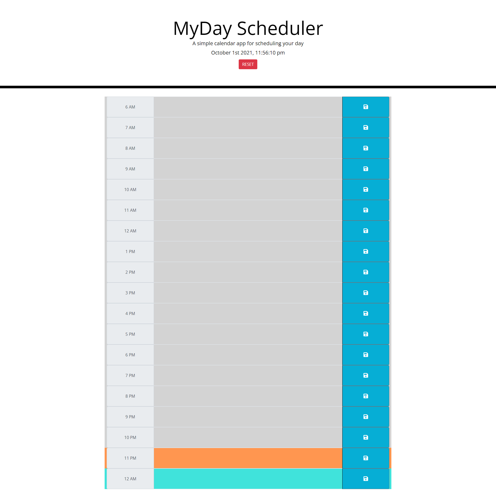
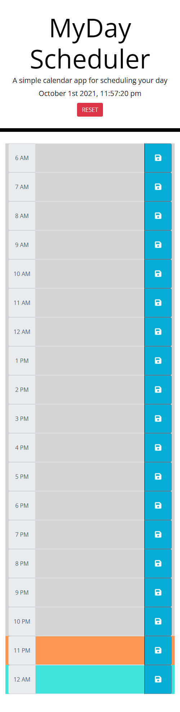

# MyDay Scheduler App

The MyDay Scheduler allows you to plan your schedule for the current day, everyday. You can add notes, daily check points, and anything todo that you need to do every hour on the hour for the day ahead.

## Features

+ Allows users add/update notes/todos/check-points to each hour of the current day
+ When saved, users will have their added/edited content stored in local storage
+ When the time passes, hour by hour, the current hour will be updated in real time
+ Hours that have passed will be highlighted in gray
+ The current hour will be highlighted in orange
+ The hours still ahead will be highlighted in blue

## Future Features

+ Once hours have passed, you will not be able to update the text inside
+ Once the day changes, the scheduler will reset so that the user can plan for the new day ahead

## Screenshot and Link To Project

### Desktop

### Mobile

[Link to Project on GitHub Pages: ](https://damienluzzo33.github.io/MyDay-Scheduler/);

## Other

+ Used the provided project gif to influence the application's design and layout